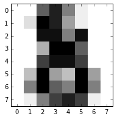
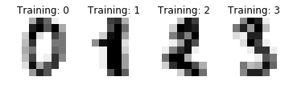

# Datasets

## 機器學習資料集/ 範例一: The digits dataset


http://scikit-learn.org/stable/auto_examples/datasets/plot_digits_last_image.html

這個範例目的是介紹機器學習範例資料集的操作，對於初學者以及授課特別適合使用。

## (一)引入函式庫及內建手寫數字資料庫


```python
#這行是在ipython notebook的介面裏專用，如果在其他介面則可以拿掉
%matplotlib inline
from sklearn import datasets

import matplotlib.pyplot as plt

#載入數字資料集
digits = datasets.load_digits()

#畫出第一個圖片
plt.figure(1, figsize=(3, 3))
plt.imshow(digits.images[-1], cmap=plt.cm.gray_r, interpolation='nearest')
plt.show()
```





## (二)資料集介紹
`digits = datasets.load_digits()` 將一個dict型別資料存入digits，我們可以用下面程式碼來觀察裏面資料


```python
for key,value in digits.items() :
    try:
        print (key,value.shape)
    except:
        print (key)

```

    ('images', (1797L, 8L, 8L))
    ('data', (1797L, 64L))
    ('target_names', (10L,))
    DESCR
    ('target', (1797L,))


| 顯示 | 說明 |
| -- | -- |
| ('images', (1797L, 8L, 8L))| 共有 1797 張影像，影像大小為 8x8 |
| ('data', (1797L, 64L)) | data 則是將8x8的矩陣攤平成64個元素之一維向量 |
| ('target_names', (10L,)) | 說明10種分類之對應 [0, 1, 2, 3, 4, 5, 6, 7, 8, 9] |
| DESCR | 資料之描述 |
| ('target', (1797L,))| 記錄1797張影像各自代表那一個數字 |

接下來我們試著以下面指令來觀察資料檔，每張影像所對照的實際數字存在`digits.target`變數中


```python
images_and_labels = list(zip(digits.images, digits.target))
for index, (image, label) in enumerate(images_and_labels[:4]):
    plt.subplot(2, 4, index + 1)
    plt.axis('off')
    plt.imshow(image, cmap=plt.cm.gray_r, interpolation='nearest')
    plt.title('Training: %i' % label)
```





```python
#接著我們嘗試將這個機器學習資料之描述檔顯示出來
print(digits['DESCR'])
```

    Optical Recognition of Handwritten Digits Data Set
    ===================================================

    Notes
    -----
    Data Set Characteristics:
        :Number of Instances: 5620
        :Number of Attributes: 64
        :Attribute Information: 8x8 image of integer pixels in the range 0..16.
        :Missing Attribute Values: None
        :Creator: E. Alpaydin (alpaydin '@' boun.edu.tr)
        :Date: July; 1998

    This is a copy of the test set of the UCI ML hand-written digits datasets
    http://archive.ics.uci.edu/ml/datasets/Optical+Recognition+of+Handwritten+Digits

    The data set contains images of hand-written digits: 10 classes where
    each class refers to a digit.

    Preprocessing programs made available by NIST were used to extract
    normalized bitmaps of handwritten digits from a preprinted form. From a
    total of 43 people, 30 contributed to the training set and different 13
    to the test set. 32x32 bitmaps are divided into nonoverlapping blocks of
    4x4 and the number of on pixels are counted in each block. This generates
    an input matrix of 8x8 where each element is an integer in the range
    0..16. This reduces dimensionality and gives invariance to small
    distortions.

    For info on NIST preprocessing routines, see M. D. Garris, J. L. Blue, G.
    T. Candela, D. L. Dimmick, J. Geist, P. J. Grother, S. A. Janet, and C.
    L. Wilson, NIST Form-Based Handprint Recognition System, NISTIR 5469,
    1994.

    References
    ----------
      - C. Kaynak (1995) Methods of Combining Multiple Classifiers and Their
        Applications to Handwritten Digit Recognition, MSc Thesis, Institute of
        Graduate Studies in Science and Engineering, Bogazici University.
      - E. Alpaydin, C. Kaynak (1998) Cascading Classifiers, Kybernetika.
      - Ken Tang and Ponnuthurai N. Suganthan and Xi Yao and A. Kai Qin.
        Linear dimensionalityreduction using relevance weighted LDA. School of
        Electrical and Electronic Engineering Nanyang Technological University.
        2005.
      - Claudio Gentile. A New Approximate Maximal Margin Classification
        Algorithm. NIPS. 2000.


這個描述檔說明了這個資料集是在 1998年時建立的，由`E. Alpaydin, C. Kaynak ，Department of Computer Engineering
Bogazici University, Istanbul Turkey ` 建立的。數字的筆跡總共來自43個人，一開始取像時為32x32的點陣影像，之後經運算處理形成 8x8影像，其中灰階記錄的範圍則為 0~16的整數。

## (三)應用範例介紹
在整個scikit-learn應用範例中，有以下幾個範例是利用了這組手寫辨識資料集。這個資料集的使用最適合機器學習初學者來理解分類法的原理以及其進階應用

 * [分類法 Classification](../Classification/Classification.md)
   * [Ex 1: Recognizing hand-written digits](../Classification/ex1_Recognizing_hand-written_digits.md)
 * [特徵選擇 Feature Selection](../Feature_Selection/intro.md)
   * [Ex 2: Recursive Feature Elimination](../Feature_Selection/ex2_Recursive_feature_elimination.md)
   * [Ex 3: Recursive Feature Elimination with Cross-Validation](../Feature_Selection/ex3_rfe_crossvalidation__md.md)


```python

```
