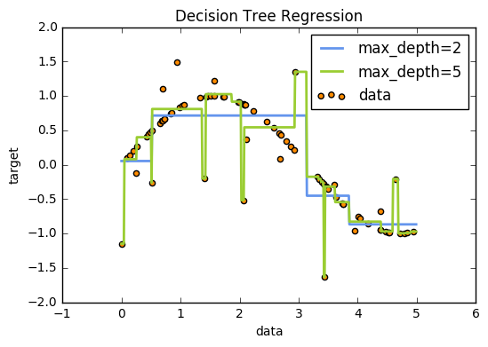

## 決策樹/範例一: Decision Tree Regression
http://scikit-learn.org/stable/auto_examples/tree/plot_tree_regression.html#sphx-glr-auto-examples-tree-plot-tree-regression-py

### 範例目的
此範例利用Decision Tree從數據中學習一組if-then-else決策規則，逼近加有雜訊的sine curve，因此它模擬出局部的線性迴歸以近似sine curve。
若決策樹深度越深(可由max_depth參數控制)，則決策規則越複雜，模型也會越接近數據，但若數據中含有雜訊，太深的樹就有可能產生過擬合的情形。
此範例模擬了不同深度的樹，當用帶有雜點的數據可能造成的情況。

### (一)引入函式庫及建立隨機數據資料
#### 引入函式資料庫
* `matplotlib.pyplot`：用來繪製影像。<br />
* `sklearn.tree import DecisionTreeRegressor`：利用決策樹方式建立預測模型。<br />

#### 特徵資料
* `np.random()`：隨機產生介於0~1之間的亂數<br />
* `RandomState.rand(d0,d1,..,dn)`：給定隨機亂數的矩陣形狀<br />
* `np.sort`將資料依大小排序。<br />

#### 目標資料
* `np.sin(X)`：以X做為徑度，計算出相對的sine值。<br />
* `ravel()`：輸出連續的一維矩陣。<br />
* `y[::5] += 3 * (0.5 - rng.rand(16))`：為目標資料加入雜訊點。<br />

```python
import numpy as np
from sklearn.tree import DecisionTreeRegressor
import matplotlib.pyplot as plt

rng = np.random.RandomState(1)
X = np.sort(5* rng.rand(80, 1), axis=0)  #0~5之間隨機產生80個數值

y = np.sin(X).ravel()
y[::5] += 3 * (0.5 - rng.rand(16)) #每5筆資料加入一個雜訊
```

### (二)建立Decision Tree迴歸模型
#### 建立模型
* `DecisionTreeRegressor(max_depth = 最大深度)`：`DecisionTreeRegressor`建立決策樹回歸模型。`max_depth`決定樹的深度，若為None則所有節點被展開。此範例會呈現不同`max_depth`對預測結果的影響。

#### 模型訓練
* `fit(特徵資料, 目標資料)`：利用特徵資料及目標資料對迴歸模型進行訓練。<br />

#### 預測結果
* `np.arrange(起始點, 結束點, 間隔)`：`np.arange(0.0, 5.0, 0.01)`在0~5之間每0.01取一格，建立預測輸入點矩陣。<br />
* `np.newaxis`：增加矩陣維度。<br />
* `predict(輸入矩陣)`：對訓練完畢的模型測試，輸出為預測結果。<br />

```python
regr_1 = DecisionTreeRegressor(max_depth=2) #最大深度為2的決策樹
regr_2 = DecisionTreeRegressor(max_depth=5) #最大深度為5的決策樹

regr_1.fit(X, y)
regr_2.fit(X, y)

X_test = np.arange(0.0, 5.0, 0.01)[:, np.newaxis]
y_1 = regr_1.predict(X_test)
y_2 = regr_2.predict(X_test)
```

### (三) 繪出預測結果與實際目標圖
* `plt.scatter(X,y)`：將X、y以點的方式繪製於平面上，c為數據點的顏色，label為圖例。<br />
* `plt.plot(X,y)`：將X、y以連線方式繪製於平面上，color為線的顏色，label為圖例，linewidth為線的寬度。<br />


```python
plt.figure()
plt.scatter(X, y, c="darkorange", label="data")
plt.plot(X_test, y_1, color="cornflowerblue", label="max_depth=2", linewidth=2)
plt.plot(X_test, y_2, color="yellowgreen", label="max_depth=5", linewidth=2)
plt.xlabel("data") #x軸代表data數值
plt.ylabel("target") #y軸代表target數值
plt.title("Decision Tree Regression") #標示圖片的標題
plt.legend() #繪出圖例
plt.show()
```



### (四)完整程式碼

```python
print(__doc__)

# Import the necessary modules and libraries
import numpy as np
from sklearn.tree import DecisionTreeRegressor
import matplotlib.pyplot as plt

# Create a random dataset
rng = np.random.RandomState(1)
X = np.sort(5 * rng.rand(80, 1), axis=0)
y = np.sin(X).ravel()
y[::5] += 3 * (0.5 - rng.rand(16))

# Fit regression model
regr_1 = DecisionTreeRegressor(max_depth=2)
regr_2 = DecisionTreeRegressor(max_depth=5)
regr_1.fit(X, y)
regr_2.fit(X, y)

# Predict
X_test = np.arange(0.0, 5.0, 0.01)[:, np.newaxis]
y_1 = regr_1.predict(X_test)
y_2 = regr_2.predict(X_test)

# Plot the results
plt.figure()
plt.scatter(X, y, c="darkorange", label="data")
plt.plot(X_test, y_1, color="cornflowerblue", label="max_depth=2", linewidth=2)
plt.plot(X_test, y_2, color="yellowgreen", label="max_depth=5", linewidth=2)
plt.xlabel("data")
plt.ylabel("target")
plt.title("Decision Tree Regression")
plt.legend()
plt.show()
```
