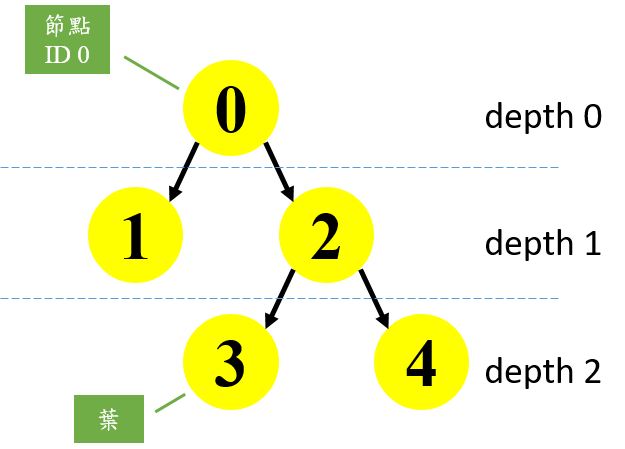

## 決策樹範例四: Understanding the decision tree structure
http://scikit-learn.org/stable/auto_examples/tree/plot_unveil_tree_structure.html#sphx-glr-auto-examples-tree-plot-unveil-tree-structure-py

### 範例目的
此範例主要在進一步探討決策樹內部的結構，分析以獲得特徵與目標之間的關係，並進而進行預測。<br />
1. 當每個節點的分支最多只有兩個稱之為二元樹結構。<br />
2. 判斷每個深度的節點是否為葉，在二元樹中若該節點為判斷的最後一層稱之為葉。<br />
3. 利用 `decision_path` 獲得決策路徑的資訊。<br />
4. 利用 `apply` 得到預測結果，也就是決策樹最後抵達的葉。<br />
5. 建立完成後的規則變能用來預測。<br />
6. 一組多個樣本可以尋得其中共同的決策路徑。<br />

### (一)引入函式庫及測試資料
#### 引入函式資料庫
* `load_iris` 引入鳶尾花資料庫。<br />

```python
from sklearn.model_selection import train_test_split 
from sklearn.datasets import load_iris
from sklearn.tree import DecisionTreeClassifier
```

#### 建立訓練、測試集及決策樹分類器
* X (特徵資料) 以及 y (目標資料)。<br />
* `train_test_split(X, y, random_state)` 將資料隨機分為測試集及訓練集。<br />
  X為特徵資料集、y為目標資料集，`random_state` 隨機數生成器。<br />
* `DecisionTreeClassifier(max_leaf_nodes, random_state)` 建立決策樹分類器。<br />
  `max_leaf_nodes` 節點為葉的最大數目，`random_state` 若存在則為隨機數生成器，若不存在則使用`np.random`。<br />
* `fit(X, y)` 用做訓練，X為訓練用特徵資料，y為目標資料。<br />

```python
iris = load_iris()
X = iris.data
y = iris.target
X_train, X_test, y_train, y_test = train_test_split(X, y, random_state=0)
estimator = DecisionTreeClassifier(max_leaf_nodes=3, random_state=0)
estimator.fit(X_train, y_train)
```


### (二) 決策樹結構探討
在`DecisionTreeClassifier` 中有個屬性 `tree_`，儲存了整個樹的結構。<br />
二元樹被表示為多個平行的矩陣，每個矩陣的第i個元素儲存著關於節點"i"的信息，節點0代表樹的根。<br />
需要注意的是，有些矩陣只適用於有分支的節點，在這種情況下，其他類型的節點的值是任意的。<br />

上述所說的矩陣包含了：
1. `node_count` ：總共的節點個數。<br />
2. `children_left`：節點左邊的節點的ID，"-1"代表該節點底下已無分支。<br />
3. `children_righ`：節點右邊的節點的ID，"-1"代表該節點底下已無分支。<br />
4. `feature`：使節點產生分支的特徵，"-2"代表該節點底下已無分支。<br />
5. `threshold`：節點的閥值。若距離不超過 threshold ，則邊的兩端就視作同一個群集。

```python
n_nodes = estimator.tree_.node_count
children_left = estimator.tree_.children_left
children_right = estimator.tree_.children_right
feature = estimator.tree_.feature
threshold = estimator.tree_.threshold
```
以下為各矩陣的內容

```python
n_nodes = 5
children_left [ 1 -1  3 -1 -1]
children_right [ 2 -1  4 -1 -1]
feature [ 3 -2  2 -2 -2]
threshold [ 0.80000001 -2.          4.94999981 -2.         -2.        ]
```

二元樹的結構所通過的各個屬性是可以被計算的，例如每個節點的深度以及是否為樹的最底層。<br />
* `node_depth` ：節點在決策樹中的深度(層)。<br />
* `is_leaves` ：該節點是否為決策樹的最底層(葉)。<br />
* `stack`：存放尚未判斷是否達決策樹底層的節點資訊。<br />

將stack的一組節點資訊pop出來，判斷該節點的左邊節點ID是否等於右邊節點ID。<br />
若不相同分別將左右節點的資訊加入stack中，若相同則該節點已達底層`is_leaves`設為True。<br />


```python
node_depth = np.zeros(shape=n_nodes)
is_leaves = np.zeros(shape=n_nodes, dtype=bool) 

stack = [(0, -1)]  #initial

while len(stack) > 0:
    node_id, parent_depth = stack.pop()
    node_depth[node_id] = parent_depth + 1
    
    # If we have a test node
    if (children_left[node_id] != children_right[node_id]):
        stack.append((children_left[node_id], parent_depth + 1))
        stack.append((children_right[node_id], parent_depth + 1))
    else:
        is_leaves[node_id] = True
```

執行過程

```python
stack len 1
node_id 0 parent_depth -1
node_depth [ 0.  0.  0.  0.  0.]
stack [(1, 0), (2, 0)]

stack len 2
node_id 2 parent_depth 0
node_depth [ 0.  0.  1.  0.  0.]
stack [(1, 0), (3, 1), (4, 1)]

stack len 3
node_id 4 parent_depth 1
node_depth [ 0.  0.  1.  0.  2.]
stack [(1, 0), (3, 1)]

stack len 2
node_id 3 parent_depth 1
node_depth [ 0.  0.  1.  2.  2.]
stack [(1, 0)]

stack len 1
node_id 1 parent_depth 0
node_depth [ 0.  1.  1.  2.  2.]
stack []

```




下面這個部分是以程式的方式印出決策樹結構，這個決策樹共有5個節點。<br />
若遇到的是test node則用閥值決定該往哪個節點前進，直到走到葉為止。<br />

```python
print("The binary tree structure has %s nodes and has "
      "the following tree structure:"
      % n_nodes)
for i in range(n_nodes):
    if is_leaves[i]:
        print("%snode=%s leaf node." % (node_depth[i] * "\t", i)) #"\t"縮排
    else:
        print("%snode=%s test node: go to node %s if X[:, %s] <= %s else to "
              "node %s."
              % (node_depth[i] * "\t",
                 i,
                 children_left[i],
                 feature[i],
                 threshold[i],
                 children_right[i],
                 ))
```

執行結果

```python
The binary tree structure has 5 nodes and has the following tree structure:
node=0 test node: go to node 1 if X[:, 3] <= 0.800000011921 else to node 2.
	node=1 leaf node.
	node=2 test node: go to node 3 if X[:, 2] <= 4.94999980927 else to node 4.
		node=3 leaf node.
		node=4 leaf node.
```

接下來要來探索每個樣本的決策路徑，利用`decision_path`方法可以讓我們得到這些資訊，`apply`存放所有sample最後抵達哪個葉。<br />
以第0筆樣本當作範例，`indices`存放每個樣本經過的節點，`indptr`存放每個樣本存放節點的位置，`node_index`中存放了第0筆樣本所經過的節點ID。<br />

```python
node_indicator = estimator.decision_path(X_test)

# Similarly, we can also have the leaves ids reached by each sample.

leave_id = estimator.apply(X_test)

# Now, it's possible to get the tests that were used to predict a sample or
# a group of samples. First, let's make it for the sample.

sample_id = 0
node_index = node_indicator.indices[node_indicator.indptr[sample_id]:
                                    node_indicator.indptr[sample_id + 1]]
print('node_index', node_index)
print('Rules used to predict sample %s: ' % sample_id)
for node_id in node_index:
    if leave_id[sample_id] != node_id:
        continue

    if (X_test[sample_id, feature[node_id]] <= threshold[node_id]):
        threshold_sign = "<="
    else:
        threshold_sign = ">"

    print("decision id node %s : (X[%s, %s] (= %s) %s %s)"
          % (node_id,
             sample_id,
             feature[node_id],
             X_test[i, feature[node_id]],
             threshold_sign,
             threshold[node_id]))

```

執行結果

```python
node_index [0 2 4]
Rules used to predict sample 0: 
decision id node 4 : (X[0, -2] (= 1.5) > -2.0)
```

接下來是探討多個樣本，是否有經過相同的節點。<br />
以樣本0、1當作範例，`node_indicator.toarray()`存放多個矩陣0代表沒有經過該節點，1代表經過該節點。`common_nodes`中存放true與false，若同一個節點相加的值等於輸入樣本的各樹，則代表該節點都有被經過。


```python
# For a group of samples, we have the following common node.
sample_ids = [0, 1]
common_nodes = (node_indicator.toarray()[sample_ids].sum(axis=0) ==
                len(sample_ids))

print('node_indicator',node_indicator.toarray()[sample_ids])
print('common_nodes',common_nodes)

common_node_id = np.arange(n_nodes)[common_nodes]
print('common_node_id',common_node_id)


print("\nThe following samples %s share the node %s in the tree"
      % (sample_ids, common_node_id))
print("It is %s %% of all nodes." % (100 * len(common_node_id) / n_nodes,))
```

執行結果

```python
node_indicator [[1 0 1 0 1]
 [1 0 1 1 0]]
common_nodes [ True False  True False False]
common_node_id [0 2]

The following samples [0, 1] share the node [0 2] in the tree
It is 40.0 % of all nodes.
```

### (三)完整程式碼

```python
import numpy as np

from sklearn.model_selection import train_test_split
from sklearn.datasets import load_iris
from sklearn.tree import DecisionTreeClassifier

iris = load_iris()
X = iris.data
y = iris.target
X_train, X_test, y_train, y_test = train_test_split(X, y, random_state=0)

estimator = DecisionTreeClassifier(max_leaf_nodes=3, random_state=0)
estimator.fit(X_train, y_train)

# The decision estimator has an attribute called tree_  which stores the entire
# tree structure and allows access to low level attributes. The binary tree
# tree_ is represented as a number of parallel arrays. The i-th element of each
# array holds information about the node `i`. Node 0 is the tree's root. NOTE:
# Some of the arrays only apply to either leaves or split nodes, resp. In this
# case the values of nodes of the other type are arbitrary!
#
# Among those arrays, we have:
#   - left_child, id of the left child of the node
#   - right_child, id of the right child of the node
#   - feature, feature used for splitting the node
#   - threshold, threshold value at the node
#

# Using those arrays, we can parse the tree structure:

n_nodes = estimator.tree_.node_count
children_left = estimator.tree_.children_left
children_right = estimator.tree_.children_right
feature = estimator.tree_.feature
threshold = estimator.tree_.threshold


# The tree structure can be traversed to compute various properties such
# as the depth of each node and whether or not it is a leaf.
node_depth = np.zeros(shape=n_nodes)
is_leaves = np.zeros(shape=n_nodes, dtype=bool)
stack = [(0, -1)]  # seed is the root node id and its parent depth
while len(stack) > 0:
    node_id, parent_depth = stack.pop()
    node_depth[node_id] = parent_depth + 1

    # If we have a test node
    if (children_left[node_id] != children_right[node_id]):
        stack.append((children_left[node_id], parent_depth + 1))
        stack.append((children_right[node_id], parent_depth + 1))
    else:
        is_leaves[node_id] = True

print("The binary tree structure has %s nodes and has "
      "the following tree structure:"
      % n_nodes)
for i in range(n_nodes):
    if is_leaves[i]:
        print("%snode=%s leaf node." % (node_depth[i] * "\t", i))
    else:
        print("%snode=%s test node: go to node %s if X[:, %s] <= %ss else to "
              "node %s."
              % (node_depth[i] * "\t",
                 i,
                 children_left[i],
                 feature[i],
                 threshold[i],
                 children_right[i],
                 ))
print()

# First let's retrieve the decision path of each sample. The decision_path
# method allows to retrieve the node indicator functions. A non zero element of
# indicator matrix at the position (i, j) indicates that the sample i goes
# through the node j.

node_indicator = estimator.decision_path(X_test)

# Similarly, we can also have the leaves ids reached by each sample.

leave_id = estimator.apply(X_test)

# Now, it's possible to get the tests that were used to predict a sample or
# a group of samples. First, let's make it for the sample.

sample_id = 0
node_index = node_indicator.indices[node_indicator.indptr[sample_id]:
                                    node_indicator.indptr[sample_id + 1]]

print('Rules used to predict sample %s: ' % sample_id)
for node_id in node_index:
    if leave_id[sample_id] != node_id:
        continue

    if (X_test[sample_id, feature[node_id]] <= threshold[node_id]):
        threshold_sign = "<="
    else:
        threshold_sign = ">"

    print("decision id node %s : (X[%s, %s] (= %s) %s %s)"
          % (node_id,
             sample_id,
             feature[node_id],
             X_test[i, feature[node_id]],
             threshold_sign,
             threshold[node_id]))

# For a group of samples, we have the following common node.
sample_ids = [0, 1]
common_nodes = (node_indicator.toarray()[sample_ids].sum(axis=0) ==
                len(sample_ids))

common_node_id = np.arange(n_nodes)[common_nodes]

print("\nThe following samples %s share the node %s in the tree"
      % (sample_ids, common_node_id))
print("It is %s %% of all nodes." % (100 * len(common_node_id) / n_nodes,))

```
