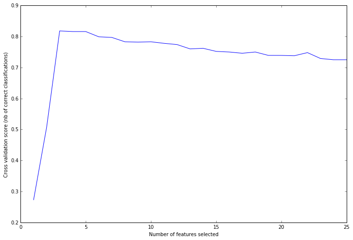

##特徵選擇/範例三: Recursive feature elimination with cross-validation

http://scikit-learn.org/stable/auto_examples/feature_selection/plot_rfe_with_cross_validation.html

REFCV比REF多一個交叉比對的分數(grid_scores_)，代表選擇多少特徵後的準確率。但REFCV不用像REF要給定選擇多少特徵，而是會依照交叉比對的分數而自動選擇訓練的特徵數。

本範例示範`RFE`的進階版，當我們在使用`RFE`指令時，需要輸入訓練特徵數目，讓訓練機能排除到其他較不具有影響力的特徵，也就是要有預期的訓練特徵數目。在`RFECV`指令提供了使用交叉驗證來選擇有最好準確率的訓練特徵數目。而交叉驗證也可以幫助我們避免訓練時造成過度訓練(overfitting)的現象，也就是當我們從某一組資料中挑出一筆訓練資料，能夠對剩下的測試資料預測出準確度最好的分類，卻發現這個分類機狀態無法準確的辨識新進資料的結果，因為這個最佳狀態只適用在特定的組合情況。因此使用`RFECV`後，我們可以從結果看出，使用多少特徵做分類判斷可以得到的準確率高低。

1. 以疊代方式計算模型
2. 以交叉驗證來取得影響力特徵


### (一)建立模擬資料

```Python
# Build a classification task using 3 informative features
X, y = make_classification(n_samples=1000, n_features=25, n_informative=3,
                           n_redundant=2, n_repeated=0, n_classes=8,
                           n_clusters_per_class=1, random_state=0)
```
說明可以參考EX1，執行過此函數後，我們可以得到具有25個特徵且有1000樣本的資料，其中具有目標影響力的特徵有三個，有兩個特徵是由具有資訊影響力的特徵線性組合出來的，而目標共有八個分類類別。

### (二)以疊代排序特徵影響力，並以交叉驗證來選出具有實際影響力的特徵

在使用`RFECV`指令前，需要建立支持向量機物件，以及交叉驗證的形式。本範例仍使用`SVC`以及線性核函數來作為主要的分類機。

在交叉驗證的部分，我們使用`StratifiedKFold`指令來做K 堆疊(Fold)的交叉驗證。也就是將資料分為K堆，一堆作為預測用，剩下的(K-1)堆則用來訓練，經過計算後，再以另外一堆作為預測，重複K次。

而`scoring`參數則是依照分類資料的形式，輸入對應的評分方式。以本例子為超過兩類型的分類，因此使用'accuracy'來對多重分類的評分方式。詳細可參考[scoring](http://scikit-learn.org/stable/modules/model_evaluation.html)

```Python
# Create the RFE object and compute a cross-validated score.
svc = SVC(kernel="linear")
# The "accuracy" scoring is proportional to the number of correct
# classifications
rfecv = RFECV(estimator=svc, step=1, cv=StratifiedKFold(y, 2),
              scoring='accuracy')
rfecv.fit(X, y)

print("Optimal number of features : %d" % rfecv.n_features_)
```


以RFECV設定好的功能物件，即可用以做訓練的動作。其結果可由n_features_得知有幾樣特徵是具有實際影響力。並可以由grid_scores_看出特徵的多寡如何影響準確率。
此功能需要設定交叉驗證的形式，本範例是以交叉驗證產生器做為輸入，其功能介紹如下。


### (三)畫出具有影響力特徵對應準確率的圖

下圖的曲線表示選擇多少個特徵來做訓練，會得到多少的準確率。



可以看到選擇三個最具有影響力的特徵時，交叉驗證的準確率高達81.8%。與建立模擬資料的n_informative=3是相對應的。


### (四) 原始碼出處
Python source code: [plot_rfe_digits.py](http://scikit-learn.org/stable/_downloads/plot_rfe_with_cross_validation.py)

```Python
print(__doc__)

import matplotlib.pyplot as plt
from sklearn.svm import SVC
from sklearn.cross_validation import StratifiedKFold
from sklearn.feature_selection import RFECV
from sklearn.datasets import make_classification

# Build a classification task using 3 informative features
X, y = make_classification(n_samples=1000, n_features=25, n_informative=3,
                           n_redundant=2, n_repeated=0, n_classes=8,
                           n_clusters_per_class=1, random_state=0)

# Create the RFE object and compute a cross-validated score.
svc = SVC(kernel="linear")
# The "accuracy" scoring is proportional to the number of correct
# classifications
rfecv = RFECV(estimator=svc, step=1, cv=StratifiedKFold(y, 2),
              scoring='accuracy')
rfecv.fit(X, y)

print("Optimal number of features : %d" % rfecv.n_features_)

# Plot number of features VS. cross-validation scores
plt.figure()
plt.xlabel("Number of features selected")
plt.ylabel("Cross validation score (nb of correct classifications)")
plt.plot(range(1, len(rfecv.grid_scores_) + 1), rfecv.grid_scores_)
plt.show()
```


##本章介紹到函式用法

###[`RFECV()`](http://scikit-learn.org/stable/modules/generated/sklearn.feature_selection.RFECV.html#sklearn.feature_selection.RFECV) 的參數


```Python
class sklearn.feature_selection.RFECV(estimator, step=1, cv=None, scoring=None, estimator_params=None, verbose=0)[source]
```

參數
* estimator
* step
* cv: 若無輸入，預設為3-fold的交叉驗證。輸入整數i，則做i-fold交叉驗證。若為物件，則以該物件做為交叉驗證產生器。
* scoring
* estimator_params
* verbose

輸出
* n\_features_: 預測有影響力的特徵的總數目
* support_: 有影響力的特徵遮罩，可以用來挑出哪些特徵
* ranking_: 各特徵的影響力程度
* grid_scores_: 從最有影響力的特徵開始加入，計算使用多少個特徵對應得到的準確率。
* estimator_
