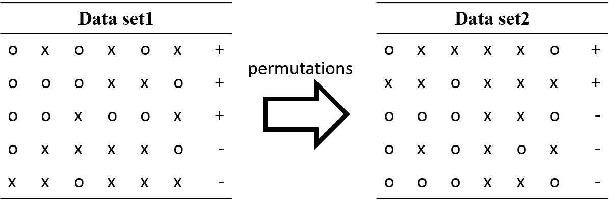

##特徵選擇/範例五: Test with permutations the significance of a classification score

http://scikit-learn.org/stable/auto_examples/feature_selection/plot_permutation_test_for_classification.html

此範例主要是用於當我們做機器學習分類時，資料標籤為無大小關係的分類，也就是第一類與第二類並無前後大小關係的分類。由於輸入分類器的標籤仍為數值，但數值的大小可能影響分類結果，因此隨機置換分類標籤以及隨機的訓練測試資料組(交叉驗證)來輸入分類機，針對不同類型的分類做對應的評分，統計出不同的資料與標籤組合所得到的準確度與標籤的顯著性。
`permutation_test_score`提供了對分類標籤做隨機置換的功能，並依照給定的置換次數來計算不同的資料組合配上置換過標籤的組合，用交叉驗證來計算準確性分佈，並統計顯著性。計算過後可取得該分類機器的真實分數與經過數次組合後取得的分數。



1. 資料集：鳶尾花
2. 特徵：萼片(sepal)之長與寬以及花瓣(petal)之長與寬
3. 預測目標：共有三種鳶尾花 setosa, versicolor, virginica
4. 機器學習方法：線性分類
5. 探討重點：變換訓練資料分類的目標標籤，減少標籤數值對分類的影響
6. 關鍵函式： `sklearn.cross_validation.permutation_test_score`


【1】Ojala and Garriga. Permutation Tests for Studying Classifier Performance. The Journal of Machine Learning Research (2010) vol. 11

### (一)取得鳶尾花資料

本範例使用`datasets.load_iris()`讀取具有4個資訊影響力特徵與150個樣本的鳶尾花資料，該資料被分類為三個類型。並且額外增加2200筆150長度的雜訊做為不具資訊影響力的特徵，來增加辨認複雜度。
```
# Loading a dataset
iris = datasets.load_iris()
X = iris.data
y = iris.target
n_classes = np.unique(y).size

# Some noisy data not correlated
random = np.random.RandomState(seed=0)
E = random.normal(size=(len(X), 2200))

# Add noisy data to the informative features for make the task harder
X = np.c_[X, E]
```

### (二)建立基本的支持向量分類機
使用`SVC`建立最基本的支持向量分類機。並設定訓練交叉驗證的摺疊系數為2。

```
svm = SVC(kernel='linear')
cv = StratifiedKFold(y, 2)
```

### (三)重複隨機變換訓練資料並統計準確率
當整理好訓練資料，以及支持向量分類機的設定後，我們以`permutation_test_score`功能來測試不同的隨機訓練資料組合，以及對應的分類機分數。除了基本的支持向量機物件、訓練資料、訓練目標，還需要指定對分類結果的評分方式、交叉驗證物件。與重複隨機變換法有關的參數像是置換次數(預設為100)與使用CPU的數目(預設為1)也可依照使用者使用情況而改變。

```
score, permutation_scores, pvalue = permutation_test_score(
    svm, X, y, scoring="accuracy", cv=cv, n_permutations=100, n_jobs=1)

print("Classification score %s (pvalue : %s)" % (score, pvalue))
```

經過計算的結果，會給予實際的分類機分數、每次隨機置換的分數以及p-value。


### (四)統計隨機置換資料算出來的分類機分數圖表

最後一個部分，就是把`permutation_test_score`算出來的結果以圖表的方式呈現。
```
###############################################################################
# View histogram of permutation scores
plt.hist(permutation_scores, 20, label='Permutation scores')
ylim = plt.ylim()
# BUG: vlines(..., linestyle='--') fails on older versions of matplotlib
#plt.vlines(score, ylim[0], ylim[1], linestyle='--',
#          color='g', linewidth=3, label='Classification Score'
#          ' (pvalue %s)' % pvalue)
#plt.vlines(1.0 / n_classes, ylim[0], ylim[1], linestyle='--',
#          color='k', linewidth=3, label='Luck')
plt.plot(2 * [score], ylim, '--g', linewidth=3,
         label='Classification Score'
         ' (pvalue %s)' % pvalue)
plt.plot(2 * [1. / n_classes], ylim, '--k', linewidth=3, label='Luck')

plt.ylim(ylim)
plt.legend()
plt.xlabel('Score')
plt.show()
```


### 原始碼出處

Python source code: [plot_select_from_model_boston.py](http://scikit-learn.org/stable/_downloads/plot_permutation_test_for_classification.py)

```Python
# Author:  Alexandre Gramfort <alexandre.gramfort@inria.fr>
# License: BSD 3 clause

print(__doc__)

import numpy as np
import matplotlib.pyplot as plt

from sklearn.svm import SVC
from sklearn.cross_validation import StratifiedKFold, permutation_test_score
from sklearn import datasets


##############################################################################
# Loading a dataset
iris = datasets.load_iris()
X = iris.data
y = iris.target
n_classes = np.unique(y).size

# Some noisy data not correlated
random = np.random.RandomState(seed=0)
E = random.normal(size=(len(X), 2200))

# Add noisy data to the informative features for make the task harder
X = np.c_[X, E]

svm = SVC(kernel='linear')
cv = StratifiedKFold(y, 2)

score, permutation_scores, pvalue = permutation_test_score(
    svm, X, y, scoring="accuracy", cv=cv, n_permutations=100, n_jobs=1)

print("Classification score %s (pvalue : %s)" % (score, pvalue))

###############################################################################
# View histogram of permutation scores
plt.hist(permutation_scores, 20, label='Permutation scores')
ylim = plt.ylim()
# BUG: vlines(..., linestyle='--') fails on older versions of matplotlib
#plt.vlines(score, ylim[0], ylim[1], linestyle='--',
#          color='g', linewidth=3, label='Classification Score'
#          ' (pvalue %s)' % pvalue)
#plt.vlines(1.0 / n_classes, ylim[0], ylim[1], linestyle='--',
#          color='k', linewidth=3, label='Luck')
plt.plot(2 * [score], ylim, '--g', linewidth=3,
         label='Classification Score'
         ' (pvalue %s)' % pvalue)
plt.plot(2 * [1. / n_classes], ylim, '--k', linewidth=3, label='Luck')

plt.ylim(ylim)
plt.legend()
plt.xlabel('Score')
plt.show()
```
