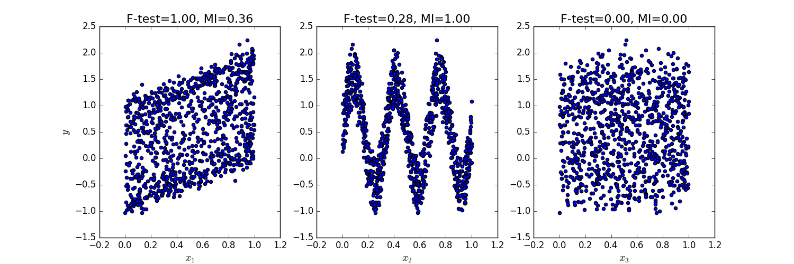

##特徵選擇/範例七: Comparison of F-test and mutual information

[http://scikit-learn.org/stable/auto_examples/feature_selection/plot_f_test_vs_mi.html#sphx-glr-auto-examples-feature-selection-plot-f-test-vs-mi-py](http://scikit-learn.org/stable/auto_examples/feature_selection/plot_f_test_vs_mi.html#sphx-glr-auto-examples-feature-selection-plot-f-test-vs-mi-py)

這個範例是解釋單變量選擇特徵的兩個方法，F-test statistics以及mutual information。單變量特徵選擇可以算是選擇特徵的預處理，用以判斷適當的特徵選擇方式。

此範例假設了三個特徵變數x1, x2, x3分布在0與1之間，並且依照下列公式模擬預測目標：
y = x1+ +sin(6 * pi * x2)+0.1 * N(0,1) 第三個特徵變量與預測目標無相關

下面的函式畫出了y與每個x_i之間的相依性，並且把F-test statistics以及mutual information的計算分數算出來，可以看到不同的變數影響方式在兩種方法會有不同的結果。

F-test 的結果只會關注線性相關的變數影響，該方法選擇x1作為最具有特徵影響力的變量。另一方面，mutual information方法可以選出經過不同函式呈現的目標變數特徵，而他選擇了X2作為最具有影響力的特徵，我們在直覺上認為能找出經過三角函數轉換過的特徵變數，更符合在這個例子中目標變數的影響方式。而兩種方法都準確的判斷x3與目標變數無相關性。



```print(__doc__)

import numpy as np
import matplotlib.pyplot as plt
from sklearn.feature_selection import f_regression, mutual_info_regression

np.random.seed(0)
X = np.random.rand(1000, 3)
y = X[:, 0] + np.sin(6 * np.pi * X[:, 1]) + 0.1 * np.random.randn(1000)

f_test, _ = f_regression(X, y)
f_test /= np.max(f_test)

mi = mutual_info_regression(X, y)
mi /= np.max(mi)

plt.figure(figsize=(15, 5))
for i in range(3):
    plt.subplot(1, 3, i + 1)
    plt.scatter(X[:, i], y)
    plt.xlabel("$x_{}$".format(i + 1), fontsize=14)
    if i == 0:
        plt.ylabel("$y$", fontsize=14)
    plt.title("F-test={:.2f}, MI={:.2f}".format(f_test[i], mi[i]),
              fontsize=16)
plt.show()
```