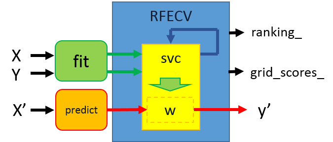
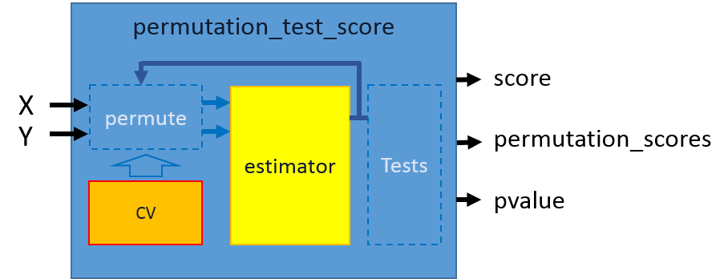

# Feature Selection

特徵選擇
特徵選擇主要是以統計特徵與目標的相關性、或以疊代排序特徵影響目標影響力的方式來逐漸排除與目標較不相關的特徵，留下與目標最相近的特徵，使判斷準確率能夠提升。

###範例一：Pipeline Anova SVM
以anova filter作為選擇特徵的依據，並示範以傳遞(Pipeline)的方式來執行特徵選擇的訓練。

###範例二:Recursive feature elimination
以重複排除最不具有特徵影響力的特徵，來減少訓練的特徵數目，直到指定的特徵數目。

###範例三:Recursive feature elimination with cross-validation
除了重複排除不具影響力的特徵外，對每次排除特徵後計算準確度，以準確度最高的特徵數目作為選定訓練特徵數目的依據。

###範例四:Feature selection using SelectFromModel and LassoCV
示範如何使用SelectFromModel函式來選擇給定的函式，並設置輸入函式的門檻值，用以判斷訓練的特徵數目。在本範例是使用LassoCV作為選擇的涵式。

###範例五:Test with permutations the significance of a classification score
本範例示範當目標類型的特徵，並無數值的大小區分時，以置換分類目標的方式來找到最高準確率的特徵挑選結果。以避免因為特徵目標分類轉換為用以區分不同類型時造成的誤判。

###範例六:Univariate Feature Selection
本範例示範用SelectPercentile以統計的方式來做特徵的選擇，並比指定的判斷函式來挑選特徵。本範例的輸入涵式為ANOVA，並以計算的F-value來做為挑選特徵的判斷。
