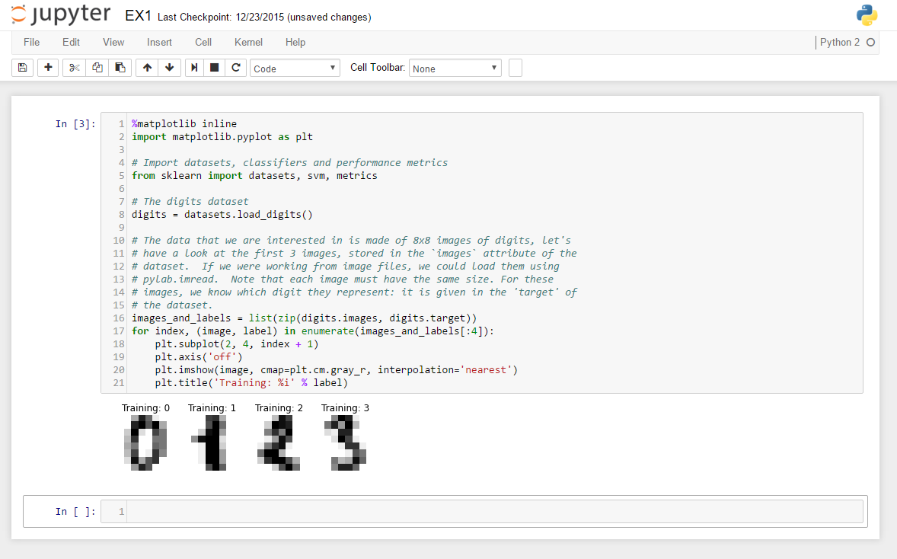
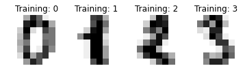

### Scikit-learn 套件的安裝
目前Scikit-learn同時支援Python 2及 3，安裝的方式也非常多種。對於初學者，最建議的方式是直接下載 Anaconda Python (https://www.continuum.io/downloads)。同時支援 Windows / OSX/ Linux 等作業系統。相關數據分析套件如Scipy, Numpy, 及圖形繪製庫 matplotlib, bokeh 會同時安裝。

### 開發介面及環境
筆者目前最常用的開發介面為IPython Notebook (3.0版後已改名為Jupyter Notebook) 以及 Atom.io 文字編輯器。在安裝Anaconda啟用IPython Notebook介面後，本文件連結之程式碼皆能夠以複製貼上的方式執行測試。目前部份章節也附有notebook格式文件 `.ipynb`檔可借下載。



### 給機器學習的初學者
本文件的目的並非探討機器學習的各項理論，我們將以應用範例著手來幫助學習。其中建議以手寫數字辨識來當成的敲門磚。而本文件中，有以下範例介紹手寫數字辨識，並且藉由這個應用來探討機器學習中的一個重要類別「監督式學習」。一開始，建議先從 [機器學習資料集 Datasets](../Datasets/ex1_the_digits_dataset.md)，來了解資料集的型態以及取得方式。接下來最重要的是釐清特徵`X`以及預測目標`y`之間的關係。要注意這邊的大寫的`X`通常代表一個矩陣, 每一列代表一筆資料，而每一行則代表其特徵。例如手寫數字辨識是利用 8x8的影像資料，來當成訓練集。而其中一種特徵的取用方法是例用這64個像素的灰階值來當成特徵。而小寫的`y`則代表一個向量，這個向量紀錄著前述訓練資料對應的「答案」。

 

 了解資料集之後，接下來則建議先嘗試 [分類法範例一](../Classification/ex1_Recognizing_hand-written_digits.md)例用最簡單的支持向量機(Support Vector Machine)分類法來達成多目標分類 (Multi-class classification)，這裏的「多目標」指的是0到9的數字，該範例利用Scikit-learn內建的SVM分類器，來找出十個目標的分類公式，並介紹如何評估分類法的準確度，以及一些常見的分類指標。例如以下報表標示著對於10個數字的預測準確度。 有了對這個範例的初步認識之後，讀者應該開始感覺到監督式學習(Supervised learning)的意義，這裏「監督」的意思是，我們已經知道資料所對應的預測目標，也就是利用圖形可猜出數字。也就是訓練集中有`y`。而另一大類別「非監督式學習」則是我們一開始並不知道`y`，我們想透過演算法來將`y`找出來。例如透過購買行為及個人資料來分類消費族群。

 ```
              precision    recall  f1-score   support

           0       1.00      0.99      0.99        88
           1       0.99      0.97      0.98        91
           2       0.99      0.99      0.99        86
           3       0.98      0.87      0.92        91
           4       0.99      0.96      0.97        92
           5       0.95      0.97      0.96        91
           6       0.99      0.99      0.99        91
           7       0.96      0.99      0.97        89
           8       0.94      1.00      0.97        88
           9       0.93      0.98      0.95        92

 avg / total       0.97      0.97      0.97       899
 ```
而有了基本的分類法，接下來的範例則是利用特徵選擇來更增進分類的準確性。以手寫數字辨識來說。上述的例子共使用了64個像素來當成特徵，然而以常理來判斷。這64個像素中，處於影像邊緣的像素參考價值應該不高，因為手寫的筆畫鮮少出現在該處。若能將這些特徵資料排除在分類公式中，通常能再增進預測的準確度。而「特徵選擇」的這項技術，主要就是用來處理這類問題。[特徵選擇範例二:Recursive Feature Elimination](../Feature_Selection/ex2_Recursive_feature_elimination.md)則是利用了Scikit-learn內建的特徵消去法，來找出消去那些特徵能夠最佳化預測的準確度。而 [特徵選擇範例三：Recursive Feature Elimination with Cross-Validation](../Feature_Selection/ex3_rfe_crossvalidation__md.md) 則使用了更進階的交叉驗證法來切分訓練集以及挑戰集來評估準確程度。建議讀者可以嘗試這幾個範例，一步步去深入機器學習的核心。
