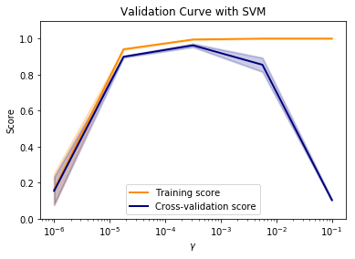

## 模型選擇/範例3 : Plotting Validation Curves

此範例的目的：
* 分析SVM不同的kernel參數：gamma，擬合模型的情況
* 經過圖示觀察不同gamma與擬合的結果

## 一、引入函式與模型
* validation_curve用於展示某一個因子，在不同值的情況下所得的score。透過這個曲線，可以直觀地看出模型中不同的參數之擬合的情況

```python
import matplotlib.pyplot as plt
import numpy as np

from sklearn.datasets import load_digits
from sklearn.svm import SVC
from sklearn.model_selection import validation_curve
```

## 二、建立dataset與模型
* Dataset取自sklearn.datasets.load_digits，內容為0~9的手寫數字，共有1797筆
* load_digits(return_X_y=True)回傳X為data，y為target
* param_range為欲改變的因子：參數gamma的值域，由10的-6次方到10的-1次方之間取5個值作為不同的gamma

```python
X, y = load_digits(return_X_y = True)
param_range = np.logspace(-6, -1, 5)
train_scores, test_scores = validation_curve(
    SVC(), X, y, param_name="gamma", param_range=param_range,
    scoring="accuracy", n_jobs=1)
train_scores_mean = np.mean(train_scores, axis=1)
train_scores_std = np.std(train_scores, axis=1)
test_scores_mean = np.mean(test_scores, axis=1)
test_scores_std = np.std(test_scores, axis=1)
```
## 三、作圖：Validation Curve
* plt.semilogx是將X軸改為對數比例
* plt.fill_between將train/test scores的平均值與標準差之間的差距用顏色填滿
* plt.legend為顯示每個數據相對應的圖例名稱，其中loc="best"為顯示圖例名稱的位置，best表示自動分配最佳位置

```python
plt.title("Validation Curve with SVM")
plt.xlabel(r"$\gamma$")
plt.ylabel("Score")
plt.ylim(0.0, 1.1)
lw = 2
plt.semilogx(param_range, train_scores_mean, label="Training score",
             color="darkorange", lw=lw)
plt.fill_between(param_range, train_scores_mean - train_scores_std,
                 train_scores_mean + train_scores_std, alpha=0.2,
                 color="darkorange", lw=lw)
plt.semilogx(param_range, test_scores_mean, label="Cross-validation score",
             color="navy", lw=lw)
plt.fill_between(param_range, test_scores_mean - test_scores_std,
                 test_scores_mean + test_scores_std, alpha=0.2,
                 color="navy", lw=lw)
plt.legend(loc="best")
plt.show()
```





由上圖的validation curve可以分析出以下三種結果：
* 很小的gamma，training scores與validation scores都很低，稱為欠擬合underfitting
* 很大的gamma，有好的training scores，但validation scores很低，稱為過擬合overfitting
* 適當的gamma，training scores與validation scores都很高，則表示分類器的效果非常好


## 四、原始碼列表
Python source code: plot_validation_curve.py

https://scikit-learn.org/stable/auto_examples/model_selection/plot_validation_curve.html

```python
print(__doc__)

import matplotlib.pyplot as plt
import numpy as np

from sklearn.datasets import load_digits
from sklearn.svm import SVC
from sklearn.model_selection import validation_curve

X, y = load_digits(return_X_y=True)

param_range = np.logspace(-6, -1, 5)
print(param_range)
train_scores, test_scores = validation_curve(
    SVC(), X, y, param_name="gamma", param_range=param_range,
    scoring="accuracy", n_jobs=1)
train_scores_mean = np.mean(train_scores, axis=1)
train_scores_std = np.std(train_scores, axis=1)
test_scores_mean = np.mean(test_scores, axis=1)
test_scores_std = np.std(test_scores, axis=1)

plt.title("Validation Curve with SVM")
plt.xlabel(r"$\gamma$")
plt.ylabel("Score")
plt.ylim(0.0, 1.1)
lw = 2
plt.semilogx(param_range, train_scores_mean, label="Training score",
             color="darkorange", lw=lw)
plt.fill_between(param_range, train_scores_mean - train_scores_std,
                 train_scores_mean + train_scores_std, alpha=0.2,
                 color="darkorange", lw=lw)
plt.semilogx(param_range, test_scores_mean, label="Cross-validation score",
             color="navy", lw=lw)
plt.fill_between(param_range, test_scores_mean - test_scores_std,
                 test_scores_mean + test_scores_std, alpha=0.2,
                 color="navy", lw=lw)
plt.legend(loc="best")
plt.show()
```
