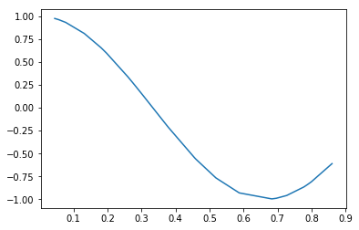
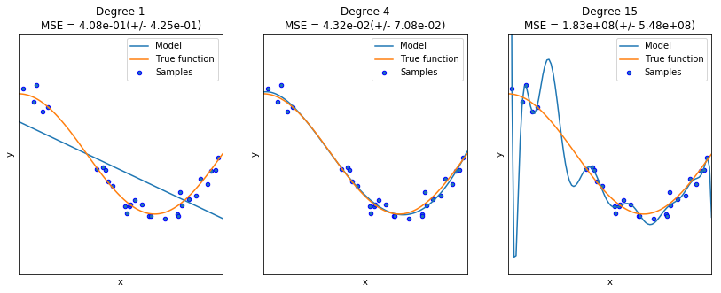

## 模型選擇/範例4 : Underfitting vs. Overfitting

此範例目的：
* 觀察Underfiting(欠擬合)與Overfitting(過度擬合)的問題
* 如何使用具有多項式特徵的線性回歸來近似非線性函數

## 一、引入函式與模型
* Pipeline將欲進行的步驟進行流式化的封裝與管理，使參數在新的測試集上被重複使用
* PolynomialFeatures用於產生多項式的特徵構造
* LinearRegression用於將資料數據擬合至一條直線上
* cross_val_score使用k交叉驗證來計算資料的誤差值

```python
import numpy as np
import matplotlib.pyplot as plt

from sklearn.pipeline import Pipeline
from sklearn.preprocessing import PolynomialFeatures
from sklearn.linear_model import LinearRegression
from sklearn.model_selection import cross_val_score
```

## 二、建立近似函數

```python
def true_fun(X):
    return np.cos(1.5 * np.pi * X)

np.random.seed(0)
n_samples = 30
X = np.sort(np.random.rand(n_samples))

plt.plot(X, true_fun(X))
plt.show()
```


該圖為欲近似的函數，其為cosine function的一部分

## 三、擬合函數、計算誤差值與繪圖
* 進行三種維度的擬合，分別為1次、4次與15次
* y為擬合資料集
* 透過PolynomialFeatures產生多項式的特徵構造
* 利用Pipeline將欲擬合的函數與資料進行線性回歸的擬合，產生具有不同程度多項式特徵的模型
* 透過cross_val_score將資料分成10組進行K交叉驗證，並計算誤差值
* 由於cross_val_score中的參數scoring會回傳最大值，但誤差值須愈小愈好，因此須回傳mean square error的負值：neg_mean_squared_error
* 產生一個新的測試集X_test，將其放入擬合過後的模型中進行預測

```python
degrees = [1, 4, 15]
y = true_fun(X) + np.random.randn(n_samples) * 0.1

plt.figure(figsize=(14, 5))
for i in range(len(degrees)):
    #擬合函數與計算誤差值
    ax = plt.subplot(1, len(degrees), i + 1)
    plt.setp(ax, xticks=(), yticks=())

    polynomial_features = PolynomialFeatures(degree=degrees[i],
                                             include_bias=False)
    linear_regression = LinearRegression()
    pipeline = Pipeline([("polynomial_features", polynomial_features),
                         ("linear_regression", linear_regression)])
    pipeline.fit(X[:, np.newaxis], y)

    # Evaluate the models using crossvalidation
    scores = cross_val_score(pipeline, X[:, np.newaxis], y,
                             scoring="neg_mean_squared_error", cv=10)
    
    #繪圖
    X_test = np.linspace(0, 1, 100)
    plt.plot(X_test, pipeline.predict(X_test[:, np.newaxis]), label="Model")
    plt.plot(X_test, true_fun(X_test), label="True function")
    plt.scatter(X, y, edgecolor='b', s=20, label="Samples")
    plt.xlabel("x")
    plt.ylabel("y")
    plt.xlim((0, 1))
    plt.ylim((-2, 2))
    plt.legend(loc="best")
    plt.title("Degree {}\nMSE = {:.2e}(+/- {:.2e})".format(
        degrees[i], -scores.mean(), scores.std()))
plt.show()
```



上圖顯示了來自real function的數個樣本以及不同模型的近似結果：
* 1次多項式的線性函數不足以訓練樣本，稱為Underfitting(欠擬合)
* 4次多項式的線性函數幾乎逼近了欲擬合的函數(true function)
* 15次多項式的線性函數因為有較高的維度，模型產生Overfitting(過度擬合)的情況

## 四、原始碼列表
Python source code: plot_underfitting_overfitting.py

https://scikit-learn.org/stable/auto_examples/model_selection/plot_underfitting_overfitting.html

```python
print(__doc__)

import numpy as np
import matplotlib.pyplot as plt
from sklearn.pipeline import Pipeline
from sklearn.preprocessing import PolynomialFeatures
from sklearn.linear_model import LinearRegression
from sklearn.model_selection import cross_val_score


def true_fun(X):
    return np.cos(1.5 * np.pi * X)

np.random.seed(0)

n_samples = 30
degrees = [1, 4, 15]

X = np.sort(np.random.rand(n_samples))
y = true_fun(X) + np.random.randn(n_samples) * 0.1

plt.figure(figsize=(14, 5))
for i in range(len(degrees)):
    ax = plt.subplot(1, len(degrees), i + 1)
    plt.setp(ax, xticks=(), yticks=())

    polynomial_features = PolynomialFeatures(degree=degrees[i],
                                             include_bias=False)
    linear_regression = LinearRegression()
    pipeline = Pipeline([("polynomial_features", polynomial_features),
                         ("linear_regression", linear_regression)])
    pipeline.fit(X[:, np.newaxis], y)

    # Evaluate the models using crossvalidation
    scores = cross_val_score(pipeline, X[:, np.newaxis], y,
                             scoring="neg_mean_squared_error", cv=10)

    X_test = np.linspace(0, 1, 100)
    plt.plot(X_test, pipeline.predict(X_test[:, np.newaxis]), label="Model")
    plt.plot(X_test, true_fun(X_test), label="True function")
    plt.scatter(X, y, edgecolor='b', s=20, label="Samples")
    plt.xlabel("x")
    plt.ylabel("y")
    plt.xlim((0, 1))
    plt.ylim((-2, 2))
    plt.legend(loc="best")
    plt.title("Degree {}\nMSE = {:.2e}(+/- {:.2e})".format(
        degrees[i], -scores.mean(), scores.std()))
plt.show()
```
