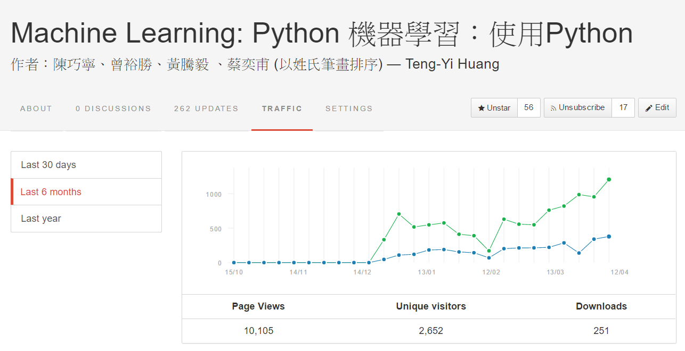
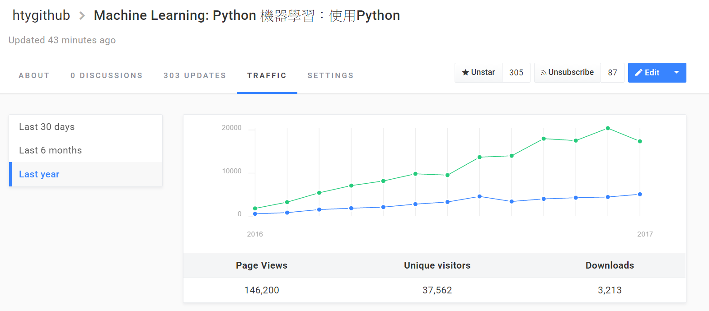

#機器學習：使用Python

這份文件的目的是要提供Python 之機器學習套件 scikit-learn (http://scikit-learn.org/) 的中文使用說明以及介紹。一開始的主要目標是詳細說明scikit-learn套件中的[範例程式](http://scikit-learn.org/stable/auto_examples/index.html )的使用流程以及相關函式的使用方法。目前使用版本為 scikit-learn version 0.19 以上。也將加入深度學習相關資料。

本書原始資料在 Github 上公開，歡迎大家共同參與維護： [https://github.com/htygithub/machine-learning-python](https://github.com/htygithub/machine-learning-python)。

## 本文件主要的版本發展
* 0.0: 2015/12/21
    * 開始本文件「機器學習：使用Python」的撰寫
    * 初期以scikit-learn套件的範例介紹為主軸
* 0.1: 2016/4/15
    * 「機器學習：使用Python」文件
    *  Contributor: 陳巧寧、曾裕勝、黃騰毅 、蔡奕甫
    *  新增章節: Classification, Clustering, cross_decomposition, Datasets, feature_selection, general_examples
    *  新增 introduction: 說明簡易的Anaconda安裝，以及利用數字辨識範例來入門機器學習的方法
    *  第 10,000個 pageview 達成

* 0.2: 2016/8/30
    *  新增應用章節，Contributor: 吳尚真
    *  增修章節: Classification, Datasets, feature_selection, general_examples
* 0.3: 2017/2/16
    *  新增應用章節，Contributor: 楊采玲、歐育年
    *  增修章節: Neural_Network, Decision tree
    *  2016年，使用者約四萬人次，頁面流量約15萬次。
* 0.4: 2019/1/10
    *  新增應用章節，Contributor: 吳秉宸、張譯云
    *  增修章節: Cluster
    *  網站移至新版gitbook

##  Scikit-learn 套件

Scikit-learn (http://scikit-learn.org/) 是一個機器學習領域的開源套件。整個專案起始於 2007年由David Cournapeau所執行的`Google Summer of Code` 計畫。而2010年之後，則由法國國家資訊暨自動化研究院（INRIA, http://www.inria.fr） 繼續主導及後續的支援及開發。近幾年(2013-2015)則由 INRIA 支持 Olivier Grisel (http://ogrisel.com) 全職負責該套件的維護工作。以開發者的角度來觀察，會發現Scikit-learn的整套使用邏輯設計的極其簡單。往往能將繁雜的機器學習理論簡化到一個步驟完成。Python的機器學習相關套件相當多，為何Scikit-learn會是首選之一呢？其實一個開源套件的選擇，最簡易的指標就是其`contributor: 貢獻者` 、 `commits:版本數量` 以及最新的更新日期。下圖是2016/1/3 經過了美好的跨年夜後，筆者於官方開源程式碼網站(https://github.com/scikit-learn/scikit-learn) 所擷取的畫面。我們可以發現最新`commit`是四小時前，且`contributor`及`commit`數量分別為531人及 20,331個。由此可知，至少在2016年，這個專案乃然非常積極的在運作。在眾多機器學習套件中，不論是貢獻者及版本數量皆是最龐大的。也因此是本文件介紹機器學習的切入點。未來，我們希望能介紹更多的機器學習套件以及理論，也歡迎有志之士共同參與維護。

