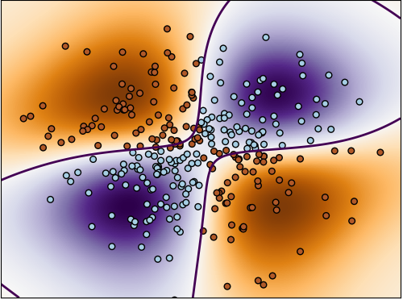

# **範例一: Non-linear SVM**

https://scikit-learn.org/stable/auto_examples/svm/plot_svm_nonlinear.html#sphx-glr-auto-examples-svm-plot-svm-nonlinear-py

此範例是展示如何使用 RBF Kernel 之非線性 SVC 去做二元分類，去預測出 XOR 的輸入分佈並用 Color Map 去繪製出分類的決策邊界及區域。

## (一)引入函式庫

引入函式如下:

1. `numpy` : 產生陣列數值
2. `matplotlib.pyplot` : 用來繪製影像
3. `sklearn.svm` : SVM 支持向量機之演算法物件

```python
import numpy as np
import matplotlib.pyplot as plt
from sklearn import svm
```
```python
xx, yy = np.meshgrid(np.linspace(-3, 3, 500),
                     np.linspace(-3, 3, 500))
np.random.seed(0)
X = np.random.randn(300, 2)
Y = np.logical_xor(X[:, 0] > 0, X[:, 1] > 0)
```
利用`np.meshgrid`生成網格採樣點，再利用`np.random.randn()`產生隨機的資料點X，接著利用`np.logical_xor`對隨機生成之資料點做 xor 的分類產生Y。

## (二)SVM Model
```python
# fit the model
clf = svm.NuSVC()
clf.fit(X, Y)
```
`svm.NuSVC`: 與 `svm.SVC` 類似，但是多了可以控制支持向量(Support Vector)個數之參數

```python
# plot the decision function for each datapoint on the grid
Z = clf.decision_function(np.c_[xx.ravel(), yy.ravel()])
Z = Z.reshape(xx.shape)

plt.imshow(Z, interpolation='nearest',
           extent=(xx.min(), xx.max(), yy.min(), yy.max()), aspect='auto',
           origin='lower', cmap=plt.cm.PuOr_r)
contours = plt.contour(xx, yy, Z, levels=[0], linewidths=2,
                       linetypes='--')
plt.scatter(X[:, 0], X[:, 1], s=30, c=Y, cmap=plt.cm.Paired,
            edgecolors='k')
plt.xticks(())
plt.yticks(())
plt.axis([-3, 3, -3, 3])
plt.show()
```
最後繪製出非線性之決策邊界及資料點分布位置，繪圖方式可參考 *EX7: SVM-Kernels* 之解說。

下方為非線性分割之結果圖 :



## (三)完整程式碼

Python source code:　plot_svm_nonlinear.py

https://scikit-learn.org/stable/_downloads/plot_svm_nonlinear.py

iPython source code: plot_svm_nonlinear.ipynb

https://scikit-learn.org/stable/_downloads/plot_svm_nonlinear.ipynb

```python
"""
==============
Non-linear SVM
==============

Perform binary classification using non-linear SVC
with RBF kernel. The target to predict is a XOR of the
inputs.

The color map illustrates the decision function learned by the SVC.
"""
print(__doc__)

import numpy as np
import matplotlib.pyplot as plt
from sklearn import svm

xx, yy = np.meshgrid(np.linspace(-3, 3, 500),
                     np.linspace(-3, 3, 500))
np.random.seed(0)
X = np.random.randn(300, 2)
Y = np.logical_xor(X[:, 0] > 0, X[:, 1] > 0)

# fit the model
clf = svm.NuSVC()
clf.fit(X, Y)

# plot the decision function for each datapoint on the grid
Z = clf.decision_function(np.c_[xx.ravel(), yy.ravel()])
Z = Z.reshape(xx.shape)

plt.imshow(Z, interpolation='nearest',
           extent=(xx.min(), xx.max(), yy.min(), yy.max()), aspect='auto',
           origin='lower', cmap=plt.cm.PuOr_r)
contours = plt.contour(xx, yy, Z, levels=[0], linewidths=2,
                       linetypes='--')
plt.scatter(X[:, 0], X[:, 1], s=30, c=Y, cmap=plt.cm.Paired,
            edgecolors='k')
plt.xticks(())
plt.yticks(())
plt.axis([-3, 3, -3, 3])
plt.show()
```
