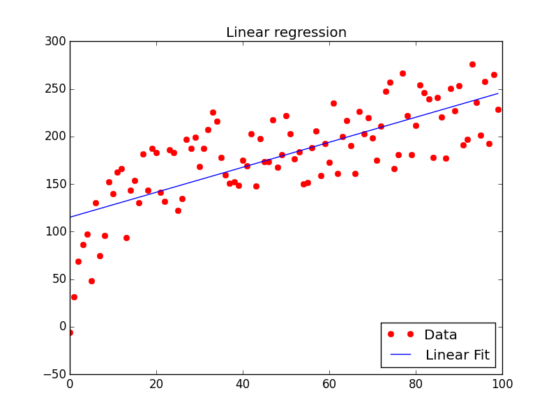
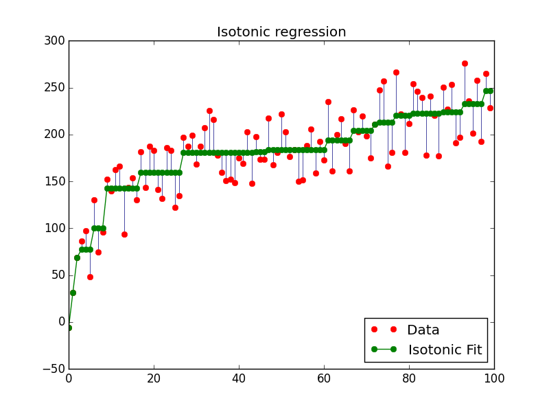
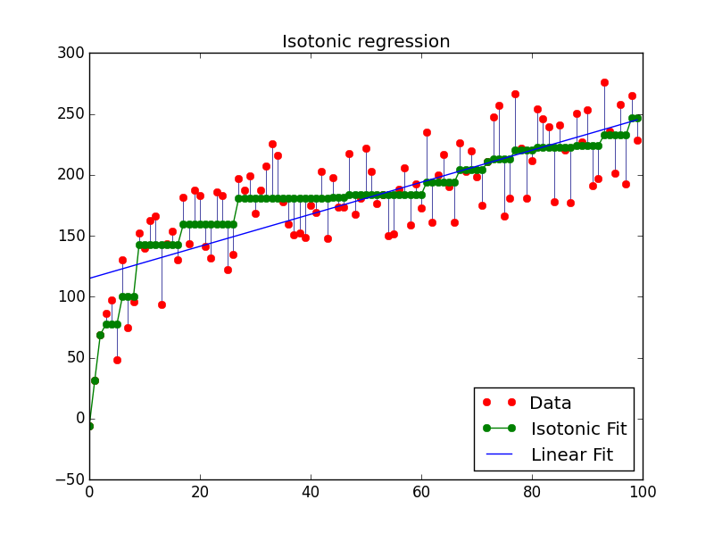

# 通用範例/範例三: Isotonic Regression

http://scikit-learn.org/stable/auto_examples/plot_isotonic_regression.html

迴歸函數採用遞增函數。

* y[] are inputs (real numbers) 
* y_[] are fitted


這個範例的主要目的：

比較

* Isotonic Fit
* Linear Fit


# (一) Regression「迴歸」
「迴歸」就是找一個函數，盡量符合手邊的一堆數據。此函數稱作「迴歸函數」。

# (二) Linear Regression「線性迴歸」
迴歸函數採用線性函數。誤差採用平方誤差。

`class sklearn.linear_model.LinearRegression`

二維數據，迴歸函數是直線。




# (三) Isotonic Regression「保序迴歸」
具有分段迴歸的效果。迴歸函數採用遞增函數。

`class sklearn.isotonic.IsotonicRegression`

採用平方誤差，時間複雜度 O(N) 。




# (四) 完整程式碼

Python source code: plot_isotonic_regression.py

http://scikit-learn.org/stable/auto_examples/plot_isotonic_regression.html

```
print(__doc__)

# Author: Nelle Varoquaux <nelle.varoquaux@gmail.com>
#         Alexandre Gramfort <alexandre.gramfort@inria.fr>
# Licence: BSD

import numpy as np
import matplotlib.pyplot as plt
from matplotlib.collections import LineCollection

from sklearn.linear_model import LinearRegression
from sklearn.isotonic import IsotonicRegression
from sklearn.utils import check_random_state

n = 100
x = np.arange(n)
rs = check_random_state(0)
y = rs.randint(-50, 50, size=(n,)) + 50. * np.log(1 + np.arange(n))

###############################################################################
# Fit IsotonicRegression and LinearRegression models

ir = IsotonicRegression()

y_ = ir.fit_transform(x, y)

lr = LinearRegression()
lr.fit(x[:, np.newaxis], y)  # x needs to be 2d for LinearRegression

###############################################################################
# plot result

segments = [[[i, y[i]], [i, y_[i]]] for i in range(n)]
lc = LineCollection(segments, zorder=0)
lc.set_array(np.ones(len(y)))
lc.set_linewidths(0.5 * np.ones(n))

fig = plt.figure()
plt.plot(x, y, 'r.', markersize=12)
plt.plot(x, y_, 'g.-', markersize=12)
plt.plot(x, lr.predict(x[:, np.newaxis]), 'b-')
plt.gca().add_collection(lc)
plt.legend(('Data', 'Isotonic Fit', 'Linear Fit'), loc='lower right')
plt.title('Isotonic regression')
plt.show()

```



