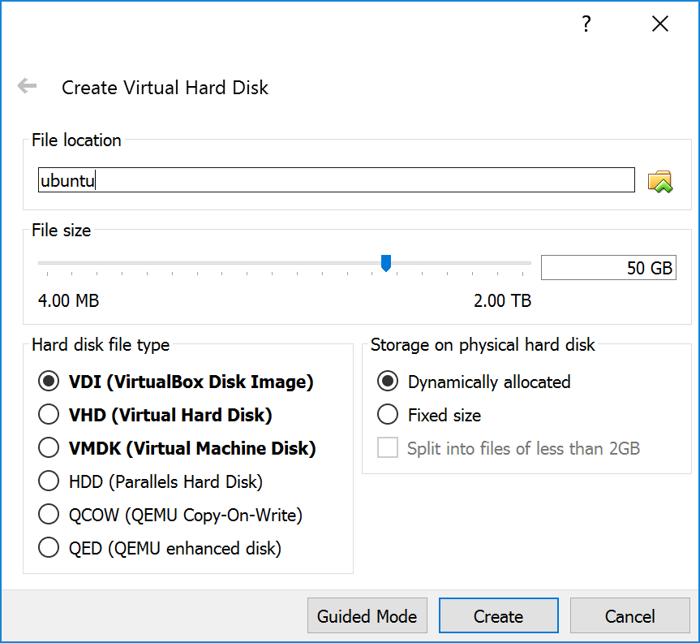
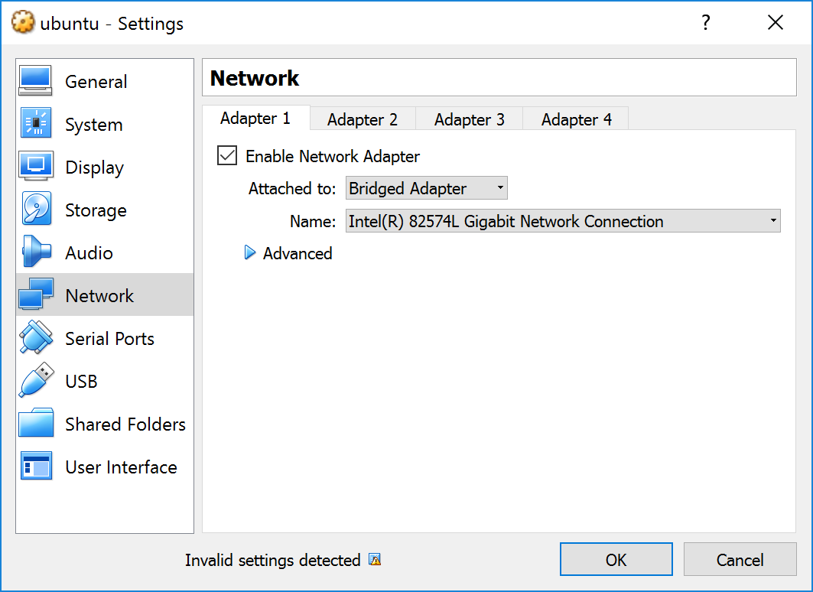

## 從零開始

灌作業系統一定是我們的首要目標，但在這之前，我們要先有一台運行 Ubuntu x64 (14.04或更新) 的電腦，可以用虛擬機來代替。

沒有虛擬機的朋友可以用[VirtualBox](https://www.virtualbox.org/wiki/Downloads)。

Ubuntu x64 的映像檔可以在[這邊](https://www.ubuntu.com/download/desktop)下載。

### 1. 安裝 VirtualBox

流程就不在這邊贅述，簡單來說，就是狂按下一步。

### 2. 安裝 Ubuntu x64

有兩點要注意：

1. 因為稍後下載回來的安裝包還會有額外的套件需要下載與編譯，所以硬碟空間要大一些，建議設定在 **50G** 以上。
    

2. 在設定 TX2 的時候，需要將 TX2 連上與 Ubuntu x64 **相同** 的區網，進行這項設定，請：

    1. 開啟 Ubuntu x64 的虛擬機設定
    2. 進入網路設定
    3. 將網路連線方式選擇**橋接**，並指定主機用來上網的網路介面
        
