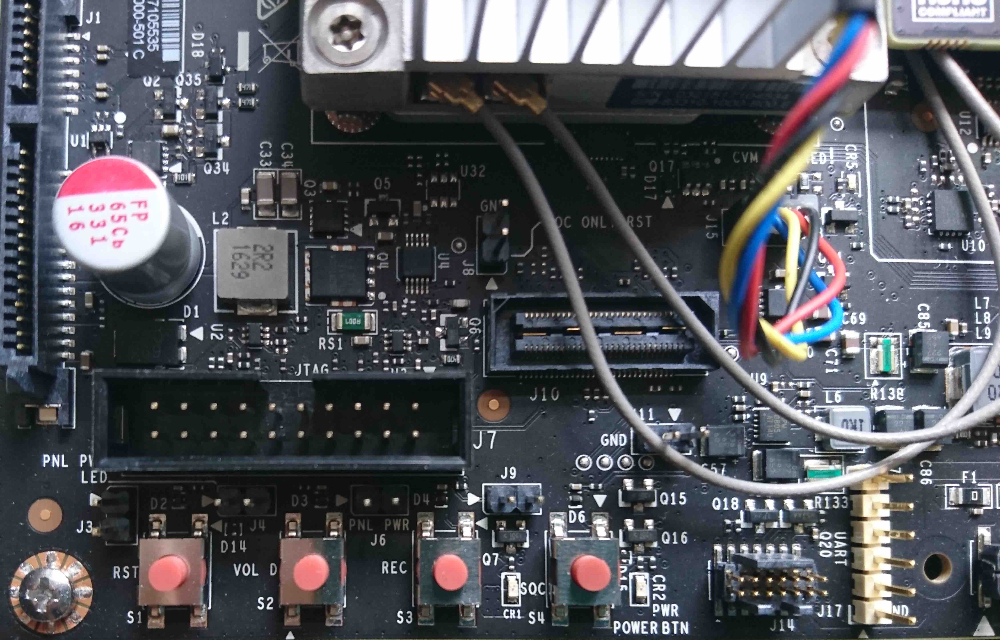

## 讓 TX2 動起來

基本上外部的設置已經完成了，接下來就要把目光轉移到 TX2 上面。

這邊我們會用到名為 Jet Pack 的官方套件，可以在[這邊](https://developer.nvidia.com/jetson-development-pack)下載他。

### 1. 執行 JetPack

注意：**這個套件要在 Ubuntu x64 上才能執行**

首先，我們需要更改 JetPack 的權限，讓他可以執行：

1. 開啟 JetPack 所在的資料夾。
2. 點右鍵，選`Open in Terminal`。
3. 執行`chmod +x JetPack-<VERSION>.run`，其中的`<VERSION>`請替換成你所下載的版本號。（可以按`tab`讓系統自動補齊檔案名稱）

基本上接下來按照指示操作即可，當出現 Terminal 視窗時：

1. 除了要將 TX2 準備在旁邊之外，你還會需要：可以和隨附的變壓器搭配的**電源線**、隨附的**micro-USB線**、夠長且良好的**網路線**、可以用**HDMI**或有HDMI轉接線可以搭配的**螢幕**、**鍵盤**、**滑鼠**。
2. 將 TX2 接上**電源**、用**micro-USB線**把 TX2 和 Ubuntu x64 連在一起、**網路線**接到和 Ubuntu x64 相同的區域網路下。
3. 在按按鈕之前，先來介紹按鈕的作用

    

    在**電源**接頭**對角**處有**1個_螺絲_**和**4顆_按鈕_**，他們分別是

    |螺絲|重設|自訂|復原|電源|
    |---|---|---|---|---|
    |   |   |   |   |   |

4. 按下**電源**開機
5. 按住**復原**別放開
6. 按下**重設**進入復原模式
7. 可以放開**復原**鍵
8. 確認 Ubuntu x64 有成功辨識 TX2，名稱會有 **NVIDIA** 或 **Jetson** 或 **TX2** 字樣
9. 在 Terminal 內按下`enter`鍵，繼續程序
10. 等待完成的訊息出現

### 2. 安裝環境

先來列出預設的帳號與密碼：

|帳號|密碼|
|---|---|
|nvidia|nvidia|
|ubuntu|ubuntu|

接下來的事情，我們都會在 Terminal 裡面完成：

1. 先更新系統

    ```sh
    $ sudo apt-get update
    $ sudo apt-get upgrade -y
    ```

2. 接著安裝常用的套件

    ```sh
    $ sudo apt-get install curl vim git mercurial silversearcher-ag htop python3-pip
    $ pip3 install --upgrade pip
    $ pip3 install virtualenv numpy
    ```

3. (Optional)安裝更方便的 zsh

    ```sh
    $ sudo apt-get install zsh
    $ sh -c "$(curl -fsSL https://raw.githubusercontent.com/robbyrussell/oh-my-zsh/master/tools/install.sh)"
    ```
